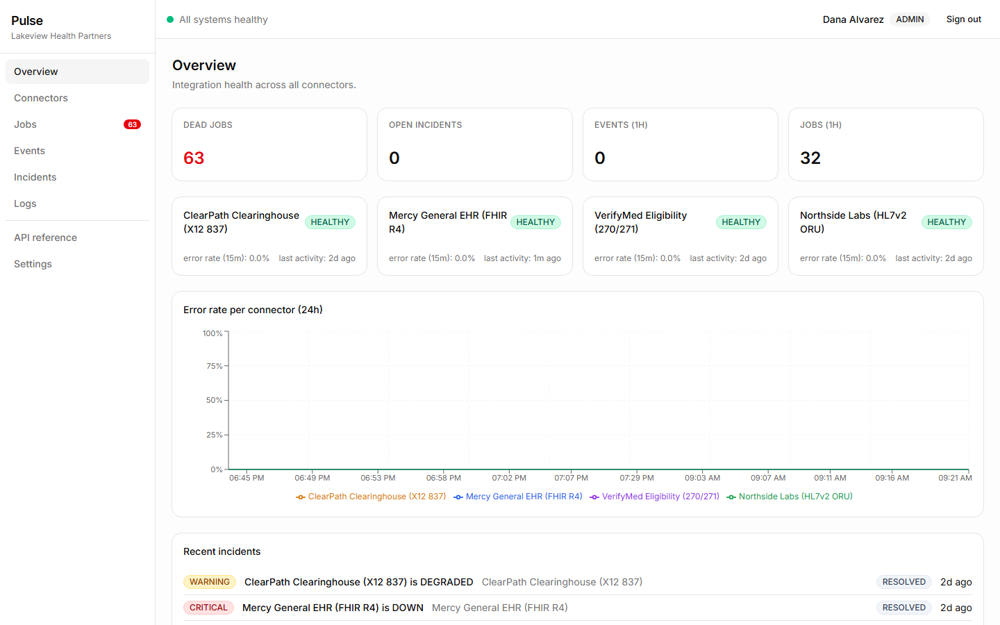
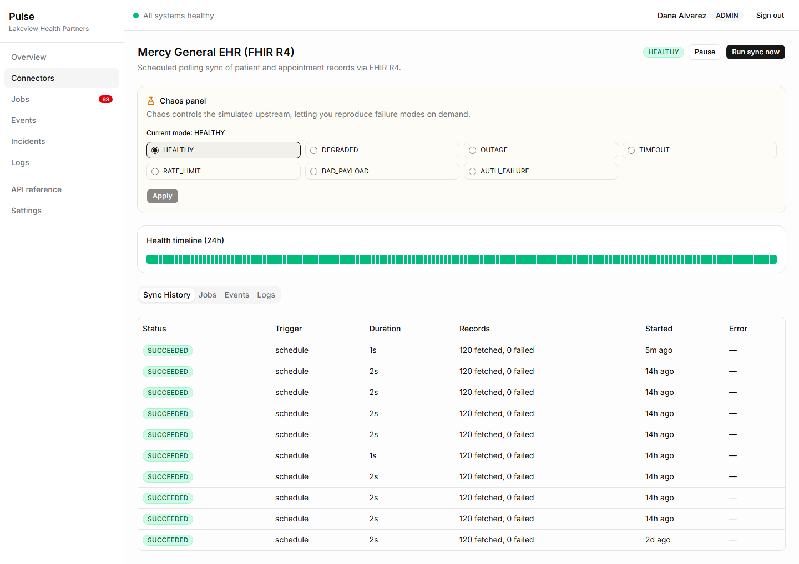
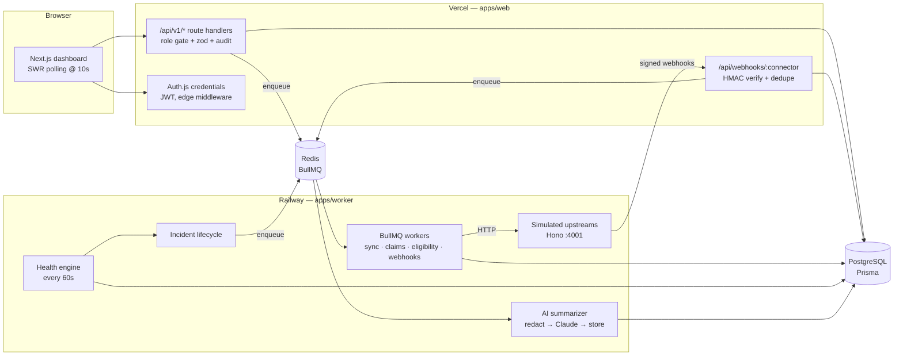
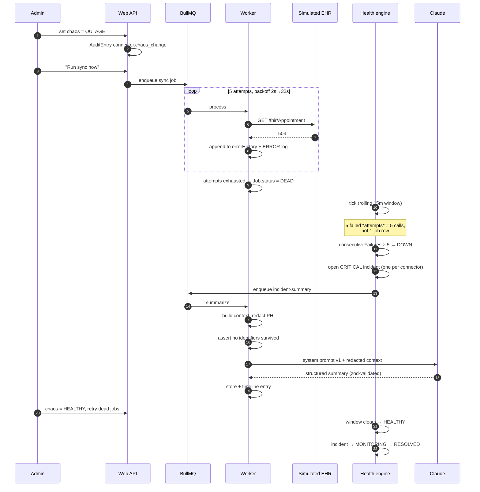
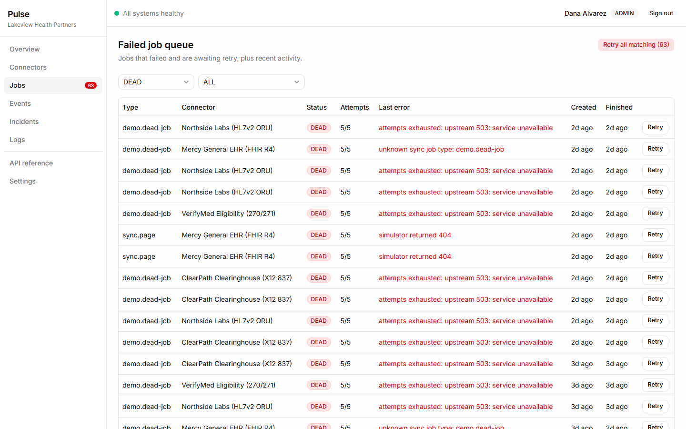
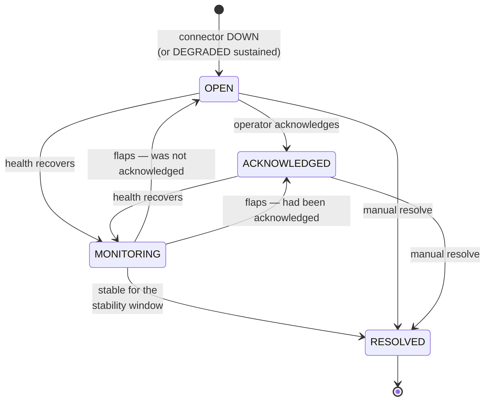
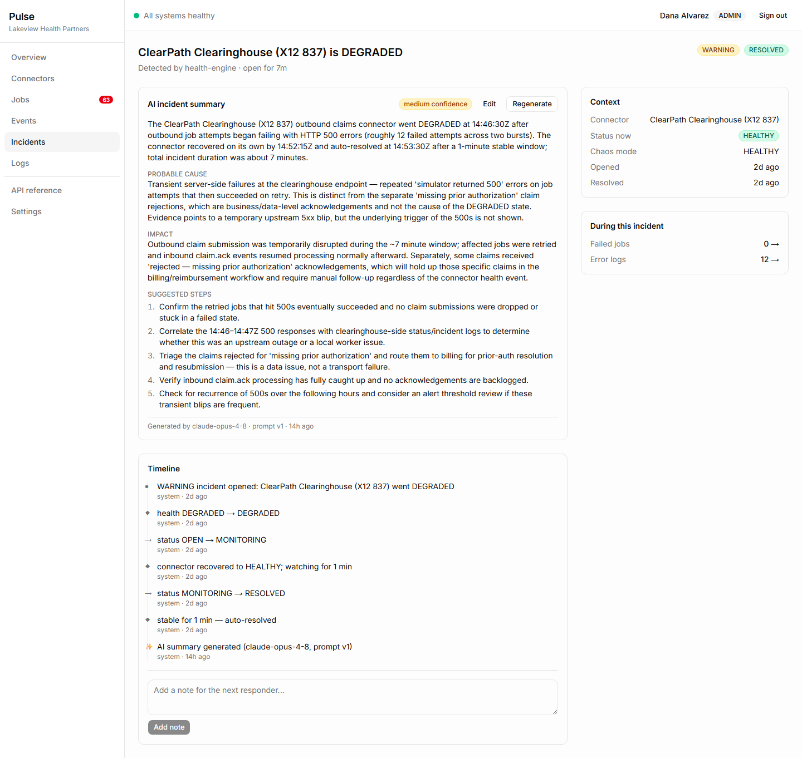
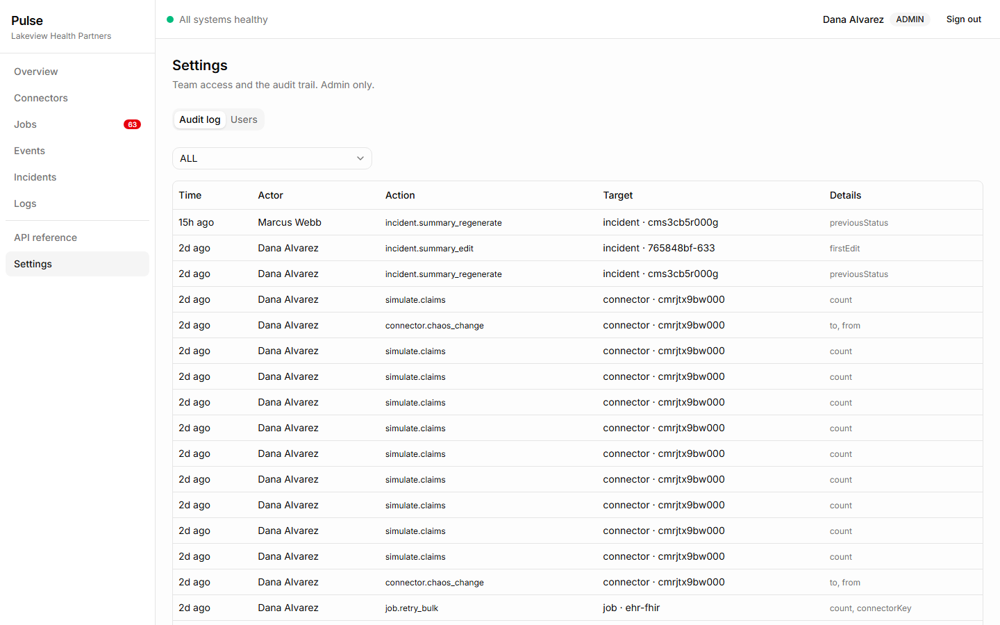

# Pulse — Integration Health Dashboard

When a hospital's integrations break, nobody finds out from a dashboard — they find out when a
clinician can't see yesterday's lab results, or when a month of claims turns out to have been
silently rejected. The systems in between (EHR syncs, lab feeds, clearinghouse submissions,
eligibility checks) are exactly the kind of plumbing that fails quietly: a vendor starts
returning 503s, a retry queue fills up, and the first symptom is a human noticing something
missing.

**Pulse is the console that makes that visible.** It runs the jobs, tracks every attempt, scores
each connector's health on a rolling window, opens an incident the moment one goes down, and
drafts a first-pass incident summary with Claude — from PHI-redacted context.



> The error-rate chart is flat here because it covers 24 hours and the seed's two failure
> clusters sit 2 and 5 days back — that is what a fresh `pnpm db:seed` actually looks like, not
> a doctored screenshot. Drive the chaos panel for a minute and it fills in.

> **All data in this project is synthetic.** The organisation (Lakeview Health Partners), the
> patients, the claims, and the four upstream vendors are fictional. No real PHI is involved
> anywhere; the redaction boundary described below exists as a design discipline, not because
> real patient data ever touches it.

**Live demo:** not yet deployed — the runbook is in [docs/deployment.md](docs/deployment.md).
**Demo logins** (password `pulse-demo-2026`):

| Persona | Email | Role | Can do |
|---|---|---|---|
| Dana Alvarez | `dana@lakeviewhealth.example` | ADMIN | Everything, plus chaos panel, users, audit log |
| Marcus Webb | `marcus@lakeviewhealth.example` | OPS | Retry jobs, acknowledge/resolve incidents, regenerate summaries |
| Priya Nair | `priya@lakeviewhealth.example` | VIEWER | Read-only |

---

## Why the failure modes are simulated

A monitoring tool is only interesting when something is broken. Rather than wait for a real
upstream to misbehave, Pulse ships the upstreams: four simulated vendors run inside the worker
process, and an admin-only **chaos panel** sets each one's failure mode on demand.

| Chaos mode | What the simulated vendor does |
|---|---|
| `HEALTHY` | Normal responses, 50–300 ms jittered latency |
| `DEGRADED` | `failureRate` (default 40%) of requests → 500; survivors get +2–8 s latency |
| `OUTAGE` | Every request → 503 |
| `TIMEOUT` | Sleeps 30 s; the client aborts at 10 s |
| `RATE_LIMIT` | 429 with `Retry-After: 15` |
| `BAD_PAYLOAD` | 200 with a schema-invalid body |
| `AUTH_FAILURE` | 401 |



This is a feature, not a test hook. Every failure path in the system is **reproducible in about
ten seconds** — including in the automated end-to-end test, which drives the same panel.

It also creates an honest evaluation problem for the AI summaries, addressed in
[AI design](#ai-design) below.

---

## Architecture



The split is forced by one constraint: **BullMQ workers need a long-running process**, which
serverless functions are not. So the dashboard and API live on Vercel, and everything that runs
continuously lives on Railway. Both talk to the same Postgres and Redis.

The simulator lives *inside* the worker rather than as a fifth service — it is the thing being
monitored, and co-locating it keeps the deployment to two services instead of three.

---

## The event flow

The sequence the demo, the Loom, and the e2e test all follow:



---

## Retry & backoff policy

Implemented in [`packages/shared/src/queue-config.ts`](packages/shared/src/queue-config.ts).

| Queue | Attempts | Backoff | Why |
|---|---|---|---|
| `sync` | 5 | exponential 2s → 32s (capped) | Transient upstream errors usually clear inside a minute |
| `webhook-processing` | 5 | exponential 2s → 32s | Same, and the dedupe key makes replays safe |
| `claims-submit` | 5 | exponential 2s → 32s | Acks arrive later as a separate webhook |
| `eligibility` | 3 | **honours `Retry-After`** | A 429 tells us exactly how long to wait; guessing over the top of an authoritative answer is wrong |
| `incident-summary` | 2 | exponential 2s | An LLM failure should surface fast, not thrash |

Details that turned out to matter:

- **Every attempt is recorded**, not just the last one. `Job.errorHistory` gets
  `{attempt, at, message, durationMs}` per failure — this is what the health engine reads.
- **`Retry-After` parsing is defensive.** `Number("soon")` is `NaN`, and a `NaN` delay makes
  BullMQ retry immediately — turning a rate-limit response into a tight loop against an upstream
  that just asked you to back off. Unusable headers fall back to 15 s; an absurd value is clamped
  to 5 minutes so a buggy vendor cannot park a job for hours.
- **Manual retry preserves history.** Retrying a DEAD job creates a new queue job against the
  same database row, resetting status but keeping `errorHistory` — that history is precisely what
  an operator needs in order to decide whether retrying is sensible.
- **Bulk retry is capped at 100 and ordered oldest-first**, so repeated runs drain the backlog
  instead of re-picking the same head.



---

## Health scoring & incident lifecycle

Health is computed on a **rolling 15-minute window** of calls, every 60 seconds. The rules are a
pure function ([`apps/worker/src/health/rules.ts`](apps/worker/src/health/rules.ts)) with no I/O
and no clock, which is why they can be exhaustively unit-tested.

```
DOWN      if consecutiveFailures ≥ 5
          or errorRate ≥ 0.5 with totalCalls ≥ 4
DEGRADED  if errorRate ≥ 0.1
          or p95 latency ≥ 5000ms
HEALTHY   otherwise
PAUSED    short-circuits everything
empty window → carry the previous status forward
```

Two of those deserve a note.

**A job row is not a call.** This was the most consequential bug in the build. The engine
originally counted each `Job` once, so a sync page that burned five retries against a dead
upstream registered as *one* failure. A total outage then produced one failing call per sync run,
the `consecutiveFailures ≥ 5` rule needed ~25 minutes to trip, and the 15-minute window (holding
~225 successes) diluted the error rate to 0.9%. Expanding each job into one call per attempt
moved failed calls in the outage window from 2 to 15, and detection landed where it should.

**An empty window carries the previous status forward.** A connector that stops responding
entirely produces no calls at all. Treating "no data" as "no errors" would mark a dead
integration healthy — the exact failure this tool exists to prevent.



- **Exactly one active incident per connector**, enforced by a re-check inside a `Serializable`
  transaction, so two concurrent ticks conflict rather than both inserting.
- **Flap rollback is stateless.** When a monitoring incident goes bad again it returns to
  `ACKNOWLEDGED` if `acknowledgedAt` is set and `OPEN` otherwise — the timestamp already records
  what the pre-monitoring state was, so no extra column is needed.

---

## AI design

Incident summaries are drafted by Claude (`claude-opus-4-8`) and are the one place in the system
where data leaves the process. The design is shaped almost entirely by that fact.



Note what the footer carries: model id, prompt version, and generation time. A summary you cannot
attribute to a specific prompt is a summary you cannot debug.

### The redaction boundary

Everything outbound passes through [`apps/worker/src/ai/redact.ts`](apps/worker/src/ai/redact.ts)
first. Two properties it must keep, both enforced by tests:

- **Ordered most-specific-first** — `Patient/PAT-4821` has to match before the bare `PAT-4821`
  rule, or the prefix is left dangling.
- **Idempotent** — redacting twice equals redacting once. The `[REDACTED:kind]` token shape is
  chosen so no rule can match its own output.

It redacts patient/claim/appointment references, member ids, SSNs, emails, phone numbers, dates
of birth, and person names — the last matched structurally (a capitalised pair next to
patient-context words) plus an exact list of seeded staff names.

Dates are the interesting case: `1974-03-02` is redacted as a DOB, but `2026-07-27T14:39:15.310Z`
is preserved, because incident timing is the most operationally useful thing in the whole
context. The rule distinguishes them by requiring no time component.

**The redactor is not trusted on its own.** Before the request is sent, the summarizer re-scans
the assembled payload for raw identifiers and throws rather than sending if any survived. A
redaction bug should fail the job, not ship PHI.

The redactor is held at **100% branch coverage** in CI, along with the health rules — the two
files this README makes claims about.

### Why the model cannot see the chaos mode

The context builder deliberately excludes the connector's chaos mode, and the connector `select`
does not even ask for the column. That mode is the ground-truth answer. Feeding it in would let
the model restate the injected fault instead of reasoning from symptoms — the summaries would
look brilliant and prove nothing.

It works. Asked about a clearinghouse incident caused by an injected 40% failure rate, the model
reported the 500s, separated them from unrelated claim rejections it found in the same window,
and said plainly that "the underlying trigger of the 500s is not shown."

### Structured output and prompt versioning

The response is constrained to a zod schema via the Anthropic SDK's structured outputs — summary,
probable cause, impact, up to five suggested steps, and a confidence level. Nothing is parsed out
of prose.

The prompt is versioned (`v1`), stored with every generated summary, and **snapshot-tested** —
editing the prompt text without bumping the version fails CI on purpose, because every stored
summary claims a version and those claims should be true.

### Degrading without a key

With no `ANTHROPIC_API_KEY`, incidents still open, the card renders "Summary unavailable — AI not
configured", and the job completes without burning its retries. The entire rest of the product
works. The e2e suite runs in exactly this configuration, so the degraded path is tested on every
commit rather than assumed.

### Cost

Bounded by construction: context is capped at 8,000 characters with repeated log lines collapsed
into `(×34)` counts, output caps at 1,500 tokens, and generation fires per incident rather than
per tick. Collapsing repeats alone took one real incident's context from 6,327 to 2,770
characters with no information lost.

---

## Metrics

Real numbers from the seeded demo corpus plus live walkthrough activity. Reproduce with:

```bash
pnpm --filter @pulse/db metrics
```

That script ([`packages/db/scripts/metrics.ts`](packages/db/scripts/metrics.ts)) prints the SQL
alongside each result, so the definitions are checkable rather than merely asserted.

| Metric | Value | Definition |
|---|---|---|
| Job error rate | **16.58%** (697 / 4,203) | Failed **attempts** over total attempts — the same definition the health engine uses |
| Retry success rate | **75.16%** (478 / 636) | Jobs that failed at least once and still ended `SUCCEEDED` |
| MTTD | **30s** | First unhealthy snapshot → incident opened. Floored by the tick interval: you cannot detect faster than you look |
| MTTR | **127m** (4 incidents; 7m–245m) | Incident opened → resolved, across seeded history and live walkthroughs |
| Throughput | **15.8 jobs/hour** | 3,182 jobs over 201 hours of history |

Corpus: 4 connectors · 3,182 jobs · 1,615 events · 4,277 log entries · 3,687 health snapshots ·
4 incidents · 27 audit entries.

The error rate looks high because the seed deliberately includes two "bad afternoon" clusters and
the walkthroughs inject outages — this is a demonstration of failure handling, and a corpus with
no failures in it would demonstrate nothing.

---

## Testing strategy

| Layer | Runs against | Covers | Count |
|---|---|---|---|
| **Unit** (`pnpm test:unit`) | nothing — pure Node | Health rules, redaction, backoff/`Retry-After` parsing, webhook signatures, AI context assembly, prompt snapshot, health-strip bucketing, OpenAPI drift | 178 |
| **Integration** (`pnpm test:integration`) | real Postgres + Redis | Health engine end-to-end, incident lifecycle, webhook ingest + dedupe, API route handlers with mocked sessions | 51 |
| **E2E** (`pnpm test:e2e`) | built app + real worker | The full demo flow, plus auth and role gates | 7 |

The split follows one rule: **if it can be a pure function, test it as one.** The health rules and
the redactor are pure by design precisely so they can be tested exhaustively — table-driven across
every branch and boundary value — and both are pinned at 100% branch coverage in CI.

Everything that only exists once a database is involved (are the right rows read? does the attempt
expansion work? does the unique index actually stop a replay?) is an integration test against real
services, not mocks. The webhook pipeline was extracted from its route handler into
`ingestWebhook()` specifically so it could be tested as a function rather than through an HTTP
server that would only add ways to be flaky.

The e2e suite runs the demo flow verbatim against a production build with a real worker,
compressed timings, and **no Anthropic key**.

```
lint-typecheck → unit ┐
                      ├→ build → e2e
              integration ┘
```

### What the tests found

Tests written after the fact still earn their keep. This suite caught, among others: a phone
regex that left `(` outside the redaction token; known-name matching that silently failed for any
name ending in punctuation; `INCIDENT_STABILITY_MIN=0` being treated as unset (making the
documented e2e configuration impossible to run); `Date.parse` accepting `"Someday, 32 Jul"` as a
valid `Retry-After`; an incident created as `aiSummaryStatus: "none"` while a summary job was
already enqueued; and a `rules` parameter whose literal types meant the injection seam could never
inject anything.

---

## Security

- **Webhooks are HMAC-SHA256 signed** and verified in constant time. A tampered body, a tampered
  signature, or a wrong secret is rejected with 401 — and **recorded** as an `INVALID` event with
  its headers captured, because a rejected delivery is the most useful row on the events page
  when a vendor's secret has drifted.
- **Replay protection** via a unique index on `(connectorId, dedupeKey)`, enforced by the database
  rather than a read-then-write check that a concurrent replay could slip through.
- **RBAC** is `VIEWER < OPS < ADMIN`, gated on the first line of every route handler — before the
  resource is looked up, so a probe for a nonexistent id gets 403 rather than disclosing which ids
  exist.

| | VIEWER | OPS | ADMIN |
|---|:-:|:-:|:-:|
| Read dashboards, jobs, events, logs, incidents | ✅ | ✅ | ✅ |
| Retry jobs · acknowledge/resolve incidents · notes · regenerate summaries | | ✅ | ✅ |
| Chaos panel · pause connectors · users · audit log | | | ✅ |

- **Every mutation writes an `AuditEntry`** with actor, action, target and metadata — no
  exceptions. The audit log is an admin-only page.


- **Password hashes are never selected** for the users endpoint's shape.
- **Synthetic data only**, and anything bound for the Anthropic API passes through the redaction
  boundary with a leak check behind it.

---

## Local development

Prerequisites: Node 22+, pnpm 9, Docker.

```bash
docker compose up -d
pnpm install
pnpm db:push
pnpm db:seed
pnpm dev
```

Open http://localhost:3010 and sign in with one of the demo persona buttons.

```bash
pnpm lint | typecheck | build
pnpm test                     # unit + integration (needs Docker)
pnpm test:coverage            # + the 100%-branch claims check
pnpm build && pnpm test:e2e   # seeds pulse_e2e, runs Playwright — see below
```

`test:e2e` does **not** build. Its Playwright config starts the web app with `next start`, which
needs an existing production build, so a missing or stale `.next` fails the run before a single
test executes (`Could not find a production build in the '.next' directory`). CI has a separate
build step ahead of its e2e job for exactly this reason. The script itself seeds `pulse_e2e` via
`apps/web/scripts/prepare-e2e-db.mjs` before Playwright starts — that runs ahead of the servers,
which a Playwright `globalSetup` could not do, since `webServer` boots first.

The screenshots above are generated, not hand-captured — run
`pnpm --filter @pulse/web screenshots` against a running stack to regenerate all five into
`docs/media/`. It signs in as the admin persona (both the chaos panel and the audit log are
ADMIN-gated) and picks the incident to shoot by querying for one with a finished AI summary.

Two things worth knowing up front: the web app runs on **:3010**, not :3000; and you must stop
`pnpm dev` before running `pnpm build`, because a dev server and a production build will fight
over `.next` and leave you with a broken bundle. The seed uses faker seed **42** — don't change
it, the tests and screenshots depend on it.

### Environment

Copy `.env.example` to `.env` (and `apps/worker/.env`, `apps/web/.env.local`). Names and local
defaults only — no secrets are committed.

| Variable | Purpose |
|---|---|
| `DATABASE_URL` | Postgres connection string |
| `REDIS_URL` | Redis connection string (BullMQ) |
| `AUTH_SECRET` | Auth.js JWT signing secret |
| `AUTH_URL` | Base URL for auth callbacks |
| `ANTHROPIC_API_KEY` | Optional — omit to exercise the graceful-degradation path |
| `ANTHROPIC_MODEL` | Defaults to `claude-opus-4-8` |
| `WEBHOOK_SIGNING_SECRET` | Shared HMAC secret; **must match** between worker and web |
| `SIMULATOR_PORT` / `SIMULATOR_BASE_URL` | Simulated upstreams |
| `WEBHOOK_TARGET_URL` | Where the simulator POSTs inbound webhooks |
| `SEED_DEMO_PASSWORD` | Password for the three demo users |
| `HEALTH_TICK_SEC` | Health engine interval (default 60) |
| `HEALTH_WINDOW_MIN` | Rolling window length (default 15) |
| `INCIDENT_STABILITY_MIN` | Minutes stable before auto-resolve (default 10; `0` = next healthy tick) |

---

## API

Hand-written OpenAPI spec: [`docs/openapi.yaml`](docs/openapi.yaml). Every `/api/v1` route
requires a session; the error envelope is uniform:

```json
{ "error": { "code": "FORBIDDEN", "message": "OPS role required" } }
```

List endpoints are cursor-paginated (`{ data, nextCursor }`), with an opt-in `?withTotal=1`. That
opt-in exists for a specific reason: `/jobs`' "Retry all matching (N)" button was counting only
the loaded page — it said 25 while the bulk retry re-queued all 63 matching DEAD jobs. The count
now comes from its own query, and the confirm dialog states what will actually happen.

---

## Tradeoffs & next steps

Things done deliberately, and what I would change with more time:

- **Polling, not websockets.** The dashboard polls every 10 s via SWR. For a fleet of four
  connectors this is honest and simple; SSE would be the next iteration, and the health tick
  already produces a natural event stream to hang it on.
- **Single-tenant.** `orgId` is threaded through every table and every query, so multi-tenancy is
  a routing and authorization problem rather than a schema migration — but it is not implemented,
  and pretending otherwise would be dishonest.
- **Hand-written OpenAPI.** Generating it from the zod schemas would remove a drift risk; the
  mitigation today is a CI check that the spec parses and that the documented routes exist.
- **No rollup tables.** Health snapshots are queried directly. At four connectors and a
  60-second tick that is ~5,700 rows/day, which Postgres does not notice. At a hundred connectors
  it would need hourly rollups.
- **The simulator lives in the worker process.** Right for a two-service deployment; wrong if the
  worker ever needed to scale horizontally, since the simulator would scale with it.
- **One incident per connector.** Deliberate — it keeps the lifecycle comprehensible. Real
  systems need correlation across connectors (one vendor outage affecting three integrations),
  which this does not model.
- **`erx` connector, alert thresholds, and runbook pages** are specified but out of scope.

---

## Repository layout

```
apps/
  web/          Next.js dashboard, /api/v1, webhook receiver, Playwright e2e
  worker/       BullMQ processors, health engine, incident lifecycle, AI, simulator
packages/
  db/           Prisma schema, migrations, seed, metrics script
  shared/       zod schemas, enums, queue config, health rules, prompts
docs/
  plan/         The phased build plan this was built from
  deployment.md Deployment runbook
  openapi.yaml  API specification
```

The build followed a written plan in [`docs/plan/`](docs/plan/), with every phase's acceptance
criteria verified and recorded in [`docs/plan/PROGRESS.md`](docs/plan/PROGRESS.md) — including
the deviations, which are the interesting part.
