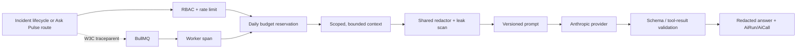

# Pulse AI architecture

Pulse treats model calls as a bounded production subsystem rather than as a helper hidden inside
an incident route. The provider is the last hop in a pipeline that prepares evidence, enforces a
privacy boundary, records telemetry, and has an honest refusal path.

## One execution model



`AiRun` is the user-visible operation: one incident summary or one copilot conversation.
`AiCall` is one provider attempt/turn. A summary retry reuses its `AiRun` and appends a call with
the BullMQ attempt number; a copilot conversation appends one call for each tool-loop turn.
Historical cost is stored on each call with `MODEL_PRICING_VERSION`, so a future pricing-table
change cannot rewrite the past.

## Privacy and evidence boundary

`packages/shared/src/redact.ts` is the only redaction implementation. It handles operational
references, member identifiers, SSNs, email/phone values, dates of birth, and known staff names.
Both summary context and copilot questions/results pass through it. The assembled payload is then
scanned again with `findLeakedIdentifiers`; a hit refuses dispatch rather than relying on a model
to remember a privacy rule.

The summary context builder intentionally does not select the connector's chaos mode. Chaos is the
ground truth used to create a demo failure, so including it would turn the model into a restater
of the test fixture. Copilot tools enforce organization, connector, incident-window, row, and
character bounds in SQL; those bounds do not come from model instructions.

Tool results are redacted, serialized, scanned again, and reduced to safe summaries for the UI.
Only those summaries and aggregate telemetry are persisted in `toolEvents`; raw provider prompts,
raw tool payloads, and secrets are not stored.

## Summary generation

Summary generation is split into `summarizePreparedContext`, a provider-injected operation, and
the database-backed context loader. The seam makes schema, leakage, pricing, and provider-error
tests deterministic without Postgres or network access. The Anthropic SDK is constructed with
`maxRetries: 0` and a 60-second timeout. BullMQ is the only retry owner:

- 408, 409, 429, connection failures, and 5xx errors are transient;
- 429 `Retry-After` is parsed and capped before becoming the custom BullMQ delay;
- configuration, redaction, schema, unpriced-model, and 4xx refusal errors are terminal;
- four total summary attempts are recorded, with intermediate runs returned to `QUEUED`.

The structured output contract is the shared `IncidentSummaryAiSchema`. Prompt `v2` treats logs,
events, and tool results as untrusted evidence, requests calibrated confidence, and requires
evidence-bounded conclusions. Prompt `v1` remains available as a comparison artifact.

## Copilot execution

Ask Pulse is an OPS-only Node route that emits fetch-compatible SSE events. Its manual loop gives
Pulse control over every provider turn:

- six turns maximum;
- 20,000 cumulative input tokens and 4,000 output tokens;
- 90-second wall-clock limit;
- configurable `$0.50` per-run cap (`AI_RUN_MAX_COST_USD`);
- cancellation finalizes the run as `CANCELLED`;
- partial answers are labelled when a budget is reached.

The six tools are read-only: `search_logs`, `get_failed_jobs`, `get_health_window`,
`get_incident_timeline`, `get_recent_events`, and `compare_health_periods`. No tool accepts an
organization, connector, or arbitrary time range from the model.

## Cost, cache, and budgets

The shared pricing table records standard input/output and cache-write/cache-read token prices.
Unknown models return `null` cost and are refused in production unless `AI_ALLOW_UNPRICED=true` is
explicitly set. Redis Lua scripts reserve the worst-case priced amount before each paid call and
settle/refund the unused amount afterward against `AI_DAILY_BUDGET_USD` (default `$5.00` per
organization per UTC day). Paid routes fail closed when Redis protection is unavailable.

Prompt caching is intentionally disabled. The summary is a single-turn request and its stable
system prefix is below the provider's useful cache threshold. Copilot cache counters are still
persisted on every call so a credentialed multi-turn smoke can prove an actual cache read before
the feature is enabled.

## Tracing and operations

Next and the worker initialize OpenTelemetry only when `OTEL_EXPORTER_OTLP_ENDPOINT` is set;
otherwise the API is a no-op. API, enqueue, queue wait, worker, model, and tool spans carry safe
attributes such as model, prompt version, token counts, cost, outcome, and provider request id.
Prompt and tool-result content is never added to spans. W3C `traceparent`/`tracestate` cross the
BullMQ payload boundary, and the active trace id is optionally persisted on `AiRun`, `AiCall`, and
`LogEntry`/API error envelopes. The local Jaeger profile is available with:

```bash
docker compose --profile observability up -d
OTEL_EXPORTER_OTLP_ENDPOINT=http://localhost:4318
```

The production Anthropic key and `AI_ENABLED=true` remain an account-owned final-smoke decision.
The repository's default path is seeded content plus an explicit `AI_NOT_CONFIGURED` refusal.
